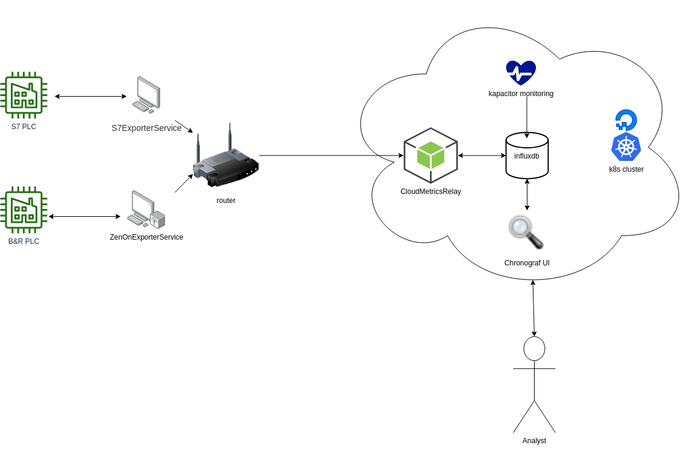

# What is this Metrics exporter good for ?

ZenonMetricsExporter ELT is a proof of concept MVP to extract live internal data from an SIMATIC S7 PLC and a B&R system without it's source code.

## So what, how does it do?

I think a diagram speaks a 1000 words to explain the whole set up. Its basically a normal ETL pipline (Extract, Transform, Load) that loads as much internal data from a system to do some easy explorative analysis.

| Component          | Responsibillity                                         | Detail                                                    |
| ------------------ | ------------------------------------------------------- | --------------------------------------------------------- |
| S7 PLC             | Controls an Kran suppliying a Wood gasifier with fuel.  | Contains live KPI'se e.g. Wood usage                      |
| B&R PLC            | Controls Wood gasifier plant / produce electricity      | KPI data maybe useful for maintence planning              |
| CloudMetrics Relay | Transform types, varibale names, and store it           | Received data exporters "service"       |
| Kapacitor          | enforce monitoring rules                                | Alert via telegram if expected data is missing            |
| Chronograf UI      | Query data, Display graphs and create dashboards        | Current interface to Influxdb                             |
| InfluxDb           | Store , Query, intervals aggregation, trash old metrics | InfluxDB an time series database for lage volumes of data |

### Closing thoughts
Reverse engineer, the PLC controllers, was the most challenging and rewarding part of this project. It fascinated me to learn how industrial automation components work. It is a simple low-level computer with a network interface that exposes its variables using a memory address register and fix sized data types.  
Perhaps WebSockets was not the best choice of protocol. My initial thought was it might become beneficial to keep a bi-directional connection between the exporter server. The need to keep message sizes small has created an unnecessary overhead of complexity, especially since an HTTP Post would have been just fine.  
